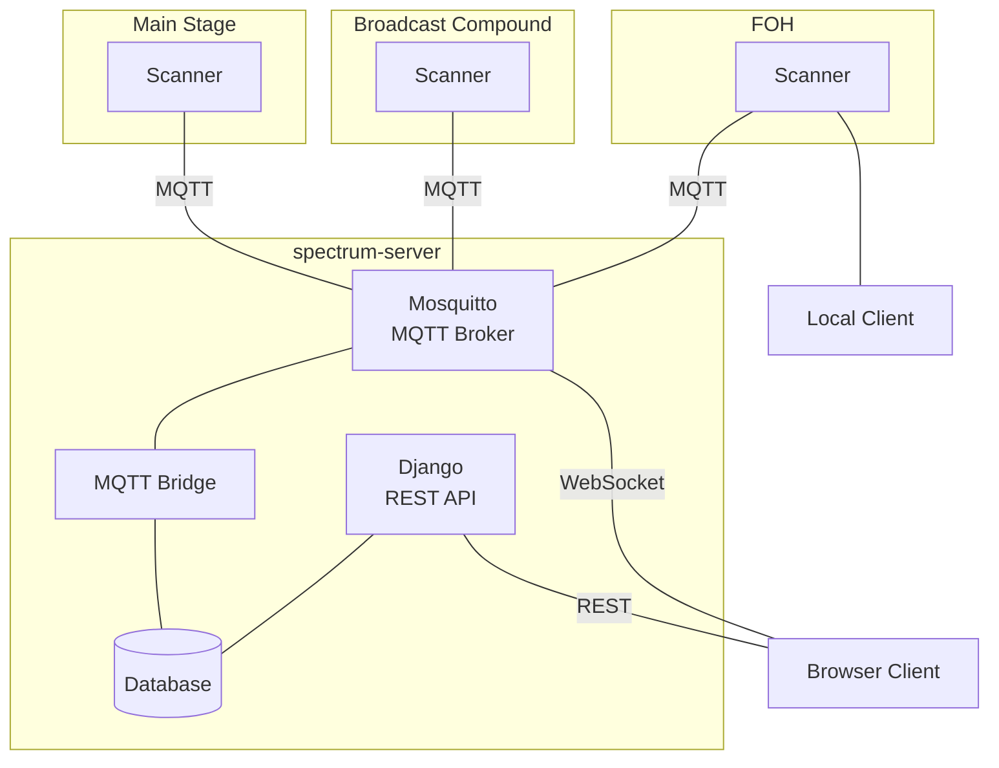

# Spectrum Scanner

Multi-band RF spectrum scanner for live event frequency coordination. Supports multiple hardware backends and deployment modes.

## Screenshots


## Use Cases

- **Standalone Operation** - Run the desktop app for local scans
- **Site Survey** - Scan venues before load-in; remotely view live and historical scan data from multiple locations
- **Live Monitoring** - Real-time visibility during shows to catch interference early
- **Multi-Zone Coverage** - Compare scan data from multiple scanners across large events, festival grounds, or rehearsal studios
- **Scan History** - Scrub back through recorded scans to analyze RF changes over time

## Supported Hardware

| Backend | Description | Connection |
|---------|-------------|-----------|
| **ADALM-Pluto** | FPGA-accelerated via [maia-sdr](https://maia-sdr.org) | USB |
| **OWON HSA1000** | Spectrum analyzer via SCPI | TCP/IP |
| **tinySA Ultra** | Portable analyzer | USB |

## Architecture



## Project Structure

```
spectrum-scanner/
├── scanner/              # Go scanner (CLI + Desktop app)
│   ├── cmd/scanner/      # CLI with embedded web UI
│   ├── cmd/desktop/      # Wails desktop application
│   ├── cmd/calibrate/    # Pluto calibration tool
│   └── internal/         # Backend implementations
├── server/               # Django central server + deployment
│   ├── api/              # REST API
│   ├── realtime/         # MQTT bridge
│   └── docker-compose.*  # Docker deployment
└── frontend/             # Vue.js frontend (shared)
```

## Quick Start

### Standalone Scanner

Run a scanner with local web UI at `http://localhost:8080`:

```bash
cd scanner

# With ADALM-Pluto
go run ./cmd/scanner -config ../config.yaml

# With OWON spectrum analyzer
go run ./cmd/scanner -backend owon -addr 10.10.125.155

# With tinySA Ultra
go run ./cmd/scanner -backend tinysa -addr /dev/tty.usbmodem4001
```

### Desktop App

```bash
cd scanner
make desktop-dev
```

### Central Server

```bash
cd server

# Development
docker compose up -d

# Production
docker compose -f docker-compose.prod.yml up -d --build
```

## Documentation

| Component | README |
|-----------|--------|
| Scanner (CLI + Desktop) | [scanner/README.md](scanner/README.md) |
| Central Server | [server/README.md](server/README.md) |
| Calibration Tool | [scanner/cmd/calibrate/README.md](scanner/cmd/calibrate/README.md) |

## Default Frequency Bands

| Band | Frequency Range | Use Case           |
|------|-----------------|--------------------|
| UHF | 470 - 608 MHz | Wireless mics, IEMs |
| Business Radio | 450 - 470 MHz | Two-way radios     |
| DECT | 1920 - 1930 MHz | Intercom           |
| WiFi 2.4 | 2400 - 2500 MHz | WiFi, Intercom     |

## License

MIT
